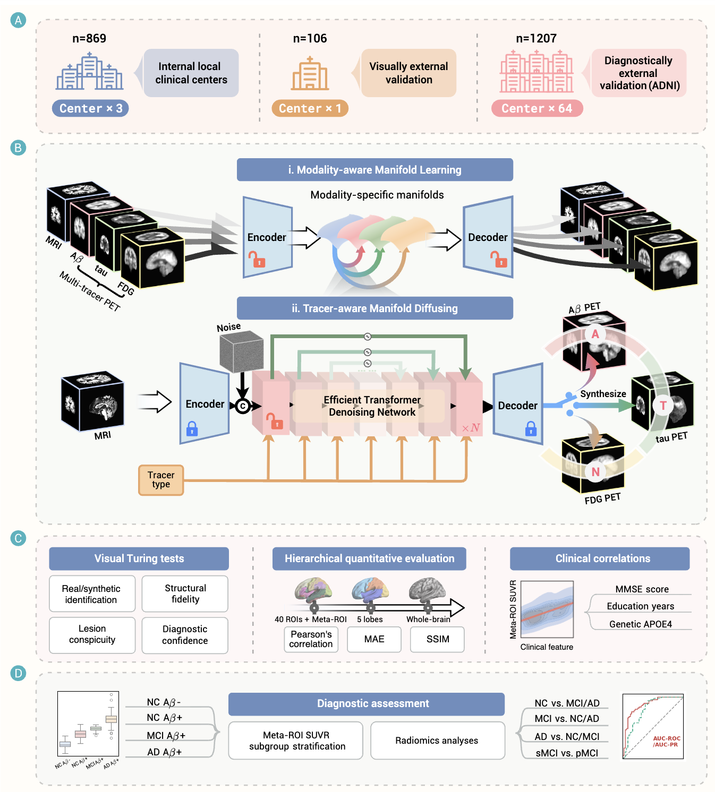

#  MaM-DiT: Manifold diffusion transformer enables diagnostic multi-tracer PET synthesis from MRI for early detection of Alzheimer's disease

[](https://www.the-innovation.org/data/article/informatics/preview/pdf/TII-2026-0026.pdf)

This is the official code implementation of **MaM-DiT** proposed in the manuscript: "**Manifold diffusion transformer enables diagnostic multi-tracer PET synthesis from MRI for early detection of Alzheimer's disease**".

## 📖 Overview

Multi-tracer PET plays a critical role in the early detection of AD by revealing pathophysiological changes prior to clinical onset or neurodegeneration detectable by MRI. However, the clinical deployment of multi-tracer PET is heavily limited by high costs and restricted accessibility. 

To bridge this gap, we introduce **MaM-DiT**, a novel **Modality-aware Manifold Diffusion Transformer** designed to synthesize high-quality, diagnostically informative multi-tracer PET images directly from MRI. By capturing complex spatiotemporal features across the amyloid–tau–neurodegeneration (A−T−N) spectrum, MaM-DiT enables an efficient, non-invasive assessment of AD pathology.

<div align="center">
  
</div>

## ✨ Structure

This repository provides the core components of the proposed framework alongside the necessary resources for reproducibility. Specifically, the codebase is structurally organized into three main training steps:

### 🚀 Installation 

Clone the repository and install the required dependencies:

```bash
    git clone https://github.com/thibault-wch/MaM-DiT.git
    cd MaM-DiT
    pip install -r requirements.txt
```

### ⚙️ Training Pipeline

**Step 1:** **`Modality_Discriminative_Model/`**: Codes for training and deploying the modality discriminator. Execute the corresponding shell script to start the training process:
```bash
    cd Modality_Discriminative_Model
    bash mdm_train.sh
```


**Step 2:** **`Unified_VAE/`**: Implementation of the 3D Variational Autoencoder for latent space compression and reconstruction.

* **Configure weights:** *First*, manually update the pre-trained weight path (obtained from the Modality Discriminative Model) within `Unified_VAE/generative/losses/modality_loss.py`. *(Note: If this specific modality loss supervision is not required for your use case, you can safely skip this step or explicitly set the corresponding loss weight to 0).*

* **Train the model:** *Then*, Execute the VAE training script:

```bash
    cd Unified_VAE
    bash vae_train.sh
```

**Step 3:** **`MaM_DiT/`**: The core MaM-DiT architecture for cross-modality generation.

* **Configure weights:** First, manually update the pre-trained weight path (obtained from the Unified VAE) within `MaM_DiT/mdm_train.py`.
* **Train the model:** Execute the MaM-DiT training script:
```bash
    cd MaM_DiT
    bash mamdit_train.sh

```


* **Inference:** Run `python MaM_DiT/inference.py` to generate the corresponding tracer-specific PET images.

> **📌 Important Note:**
> 
> 1. All models in this framework utilize a **two-stage training strategy**. They are first trained on low-resolution data (128 × 128 × 128), then fine-tuned on full-resolution images. 
>
> 2. **`ADNI-PTID.xlsx`**: Contains the specific subject IDs from the **ADNI database** used in our experiments. This is provided to facilitate exact data splits and ensure full reproducibility.

### 🛠️ Preprocessing and Evaluation

We have open-sourced our standardized pipeline for data processing and metric calculation. Please refer to our **[Unified 3D Cross-Modality Synthesis Codebase](https://github.com/thibault-wch/A-Unified-3D-Cross-Modality-Synthesis-Codebase)** for: 1)  **[Multi-thread preprocessing](https://github.com/thibault-wch/A-Unified-3D-Cross-Modality-Synthesis-Codebase/tree/main/preprocess)** codes for 3D MRI and PET brain images. 2) **[3D evaluation methods](https://github.com/thibault-wch/A-Unified-3D-Cross-Modality-Synthesis-Codebase/tree/main/evaluation)** (including MAE, SSIM, PSNR, etc.).

## 📝 Citation

If you find this code or our paper useful for your research, please star 🌟 this repository and cite our work:

```bibtex
@article{wang2026manifold,
  title={Manifold diffusion transformer enables diagnostic multi-tracer {PET} synthesis from {MRI} for early detection of {Alzheimer's} disease},
  author={Wang, Chenhui and Piao, Sirong and Wang, Jie and Li, Zhaoyang and Chen, Tao and Cui, Mei and Zhao, Jun and Guo, Qihao and Zhang, Junping and Xie, Fang and others},
  journal={The Innovation Informatics},
  volume={2},
  number={2},
  pages={100048},
  year={2026},
  publisher={The Innovation Informatics}
}

```
